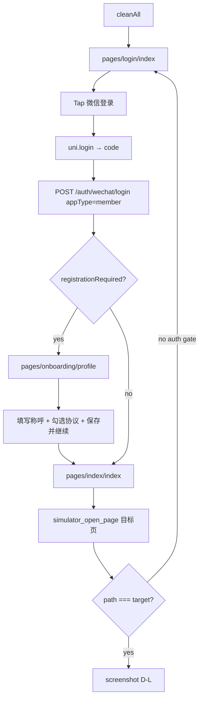
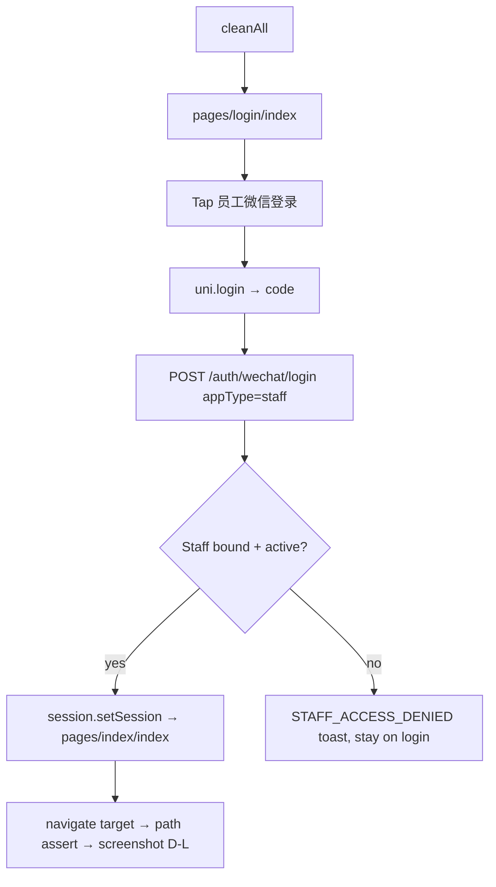

# DevTools acceptance notes — mijing-next P1–P4 + Phase D batch

**Verified at:** 2026-07-13T05:45+08:00 (live-login capture refactor; sample run blocked by MCP timeout)  
**DevTools client (this machine):** `cursor` (lowercase — per Cursor agent registration)  
**Backend:** `http://127.0.0.1:8010` health OK  
**MCP status:** `CONNECT_ERROR` — DevTools MCP port timeout; run `wechatide auth -c cursor` and approve MCP in DevTools before capture

## Login flow audit (post-cleanAll)

### Member (`member-miniapp`)



| Step | Code / API | Notes |
|------|------------|-------|
| Guard | `auth/guard.ts` `requireMemberAuth` | No token → `redirectToLogin`; incomplete reg → `redirectToOnboarding` |
| Login UI | `pages/login/index.vue` | `uni.login` + `POST /auth/wechat/login` → `session.setToken` → `reLaunch` |
| Onboarding | `pages/onboarding/profile.vue` | `PUT /member/profile` + optional `POST /member/memberships` |
| Context | `composables/member-context.ts` | `ensureMemberContext` loads joined sites after auth |
| Backend | `AuthController::login` + `MemberRegistrationService` | Token abilities `client:member`; state `profile_required` / `complete` |

**After cleanAll:** landing on `pages/login/index` is **correct**. Do not inject session to skip login.

### Staff (`staff-miniapp`)



| Step | Code / API | Notes |
|------|------------|-------|
| Guard | `auth/guard.ts` `requireStaffAuth` | Validates via `GET /me` → `staffProfiles[0]` |
| Login UI | `pages/login/index.vue` | `session.setSession` with tenant, permissions, sites |
| Backend | `AuthController::login` | Requires active `Staff` with sites; `StaffSessionDataService` |
| Bind prereq | `php artisan staff:bind-wechat-code <code> --employee-no=ADMIN001` | One-time: binds DevTools `wx.login` openid to ADMIN001 |

**After cleanAll:** landing on `pages/login/index` is **correct**. Prefer button login over `staff-report-session.js` inject.

## Auth mode labels

| Label | Method | When |
|-------|--------|------|
| **D-L** | UI tap → `wx.login` → API → onboarding (member) → navigate | **Default** (`ACCEPTANCE_AUTH_MODE=live` or unset) |
| **D-S** | `member-polish-session.js` / `staff-report-session.js` via `automation_evaluate` | Fallback only: `ACCEPTANCE_AUTH_MODE=seed` |

Record **D-L** or **D-S** per screenshot in evidence JSON (`authModes` field).

## L5 capture SOP (live login)

1. `pnpm build:staff` + `pnpm build:member`
2. `php artisan serve --port=8010` (or verify health 200)
3. `wechatide auth -c cursor` — MCP authorized, `check_devtools_status` has `openid`
4. Seed fixtures: `seed-acceptance-fixtures.php` / `seed-overnight-batch-fixtures.php`
5. **Per app session:**
   - `open_project_window` → dist path
   - `debug_clear_cache --action cleanAll` → wait ~4s
   - `simulator_open_page --page pages/login/index`
   - `automation_element_action --selector .login-page .u-button --action tap`
   - Member: if `pages/onboarding/profile` → fill `.native-input`, tap `.consent-row`, tap save `.u-button`
   - `simulator_open_page --page <target> [--query …]`
   - `automation_runtime_info --action currentPage` — **must match target before screenshot**
   - `automation_viewport_action screenshot` → ASCII temp → copy to `docs/generated/`

**Runners:**

| Script | Purpose |
|--------|---------|
| `devtools-live-login-lib.js` | Shared D-L helpers |
| `capture-live-login-sample.js` | 5-shot proof (3 staff + 2 member) |
| `capture-acceptance-shots-cache-clear.js` | Canonical P1–P4 batch (D-L default) |
| `capture-overnight-batch-shots.js` | Overnight batch (D-L default) |

```bash
set CURSOR_WECHAT_CLIENT=cursor
node docs/generated/capture-live-login-sample.js
# Fallback inject:
set ACCEPTANCE_AUTH_MODE=seed
node docs/generated/capture-overnight-batch-shots.js
```

## DevTools client: Cursor vs Codex

`wechatide -c <clientName>` binds CLI/MCP authorization **per agent**. Cursor and Codex are separate clients — auth for one does not carry to the other.

| Environment | `-c` value | Auth command |
|-------------|-----------|--------------|
| **Cursor IDE** (this workspace) | `Cursor` | `wechatide auth -c Cursor` |
| `cursor` (lowercase) | separate client — do not use unless explicitly auth'd | `wechatide auth -c cursor` |
| **Codex** | `Codex` | `wechatide auth -c Codex` |

Capture scripts read `CURSOR_WECHAT_CLIENT` (or `WECHAT_IDE_CLIENT`, default `cursor`).

```bash
set WECHAT_IDE_CLIENT=cursor
node docs/generated/capture-live-login-sample.js
```

**First-time setup (cursor client):**

1. Start 微信开发者工具 (or let `wechatide auth` launch it).
2. **设置 → 安全设置 → 服务端口** — ensure **打开** (MCP listens on `127.0.0.1:39xxx`).
3. `wechatide auth -c cursor` — approve the MCP authorization popup in DevTools if shown.
4. `wechatide -c cursor -t check_devtools_status --skill-version 0.2.5` — confirm `openid` present (not `loginExpired`).
5. Staff first-time bind (once per DevTools WeChat): get `wx.login` code from staff simulator console, then `php artisan staff:bind-wechat-code <code> --employee-no=ADMIN001`.

**No popup is often OK:** When `wechatide auth -c Cursor` returns `"alreadyTrusted": true` with a `port`, MCP is already authorized — no dialog expected. Dialog may be behind other windows, in DevTools notification area, or under **设置 / 工具** MCP entries.

**Note:** `cursor` (lowercase) and `Cursor` are **distinct** client registrations. This IDE uses **`Cursor`** (capital C).

## REQUIRED: cache clear before capture

**Root cause of prior blank/missing screenshots:** DevTools simulator cache was not cleared after `pnpm build:*`, so stale compiled assets and auth state produced blank pages.

**Mandatory step** — run after `project_open_window` and before login, for **each** miniapp:

```bash
wechatide -c cursor -t debug_clear_cache --project <dist/mp-weixin> --action cleanAll
```

Wait ~4s for simulator refresh, then **live login** (tap 微信登录). Session inject (`*-session.js`) is **D-S fallback only** — not the default acceptance path.

**Per-app workflow (D-L):**

1. `pnpm build:staff` / `pnpm build:member`
2. `project_open_window` → dist path
3. **`debug_clear_cache cleanAll`** ← REQUIRED
4. Open `pages/login/index` → tap `.login-page .u-button`
5. Member: complete onboarding if redirected to `pages/onboarding/profile`
6. `simulator_open_page --page … --query …` (never embed `?` in `--page`)
7. **Path assert** (`automation_runtime_info currentPage`) === target
8. Pause 3–5s → `automation_viewport_action screenshot`

Canonical runner: `docs/generated/capture-acceptance-shots-cache-clear.js` (uses `devtools-live-login-lib.js`)

## Build

From `mijing-next/`:

```bash
pnpm build:staff
pnpm build:member
```

Both completed successfully (Sass deprecation warnings only; `DONE Build complete.`).

Dist targets opened in DevTools:

- `mijing-next/apps/staff-miniapp/dist/build/mp-weixin`
- `mijing-next/apps/member-miniapp/dist/build/mp-weixin`

## Auth

### Staff (D-L preferred)

- **Method (D-L):** Tap「员工微信登录」→ `wx.login` → `POST /auth/wechat/login` appType=staff → `session.setSession` → `pages/index/index`.
- **Prereq:** DevTools simulator openid must be bound to an active staff record:
  ```bash
  php artisan staff:bind-wechat-code <wx.login-code> --employee-no=ADMIN001
  ```
  Obtain `<wx.login-code>` from a one-off `automation_evaluate` with `wx.login` in staff dist, or from stage04 docs.
- **D-S fallback:** `docs/generated/staff-report-session.js` via `automation_evaluate` — set `ACCEPTANCE_AUTH_MODE=seed`.

### Member (D-L preferred)

- **Method (D-L):** Tap「微信登录」→ API → if `registrationRequired`, complete `pages/onboarding/profile` (称呼 + 协议) → `pages/index/index`.
- **After cleanAll:** `profile_required` onboarding is **expected** for a fresh DevTools WeChat identity — complete it in the capture script, do not bypass.
- **D-S fallback:** `docs/generated/member-polish-session.js` — set `ACCEPTANCE_AUTH_MODE=seed`.

## Fixture seeding (site 2)

Ran `docs/generated/seed-acceptance-fixtures.php` (extended with confirmed appointments):

- Session id=1 on 2026-07-11 18:00 (瑜伽团课, booked 2/12)
- Appointments for `MEM-ACCEPT-1` + `MEM-ACCEPT-2` with fulfillment action buttons
- Card product id=3 (`储值卡 1000`) for staff catalog/edit shots

Site 1 card catalog uses `CardProductSeeder` products (储值卡 1000, 瑜伽 10 次卡).

## Screenshot targets (cache-clear retake — 2026-07-11)

| File | Status | Notes |
|------|--------|-------|
| `staff-session-fulfillment.png` | OK | Session detail id=1: roster 2/12, fulfillment action buttons |
| `staff-card-products-list.png` | OK | 在售卡种 + 回收站 tabs |
| `staff-card-products-edit.png` | OK | Edit form id=3 with course-scope checkbox |
| `staff-report-hub.png` | OK | Report hub landing |
| `staff-report-exports.png` | OK | `seed-processing-export.php` → `.job-card` with **处理中** |
| `staff-home-dashboard.png` | OK | Staff home dashboard |
| `staff-course-daily-board.png` | OK | Daily course board |
| `staff-members-list.png` | OK | CRM member list (`pages/members/index`) |
| `member-home.png` | OK | Member home tab |
| `member-booking.png` | OK | Booking tab |
| `member-cards.png` | OK | My cards wallet |
| `member-card-catalog.png` | OK | Catalog with demo banner + on-sale products |
| `member-mine.png` | OK | Mine tab |
| `member-ranking.png` | OK | Monthly ranking (`pages/mine/ranking`) |
| `member-card-purchase-success.png` | OK | `seed-member-purchase-shot.php` + `showModal` **购卡成功** |

## Screenshot targets (Phase D — 2026-07-11)

`pnpm build:staff` + `pnpm build:member` → `cleanAll` per app → session inject → capture via ASCII temp (`C:/Users/Zhong/AppData/Local/Temp/*.png` → copy to `docs/generated/`).

| File | Status | Route / notes |
|------|--------|---------------|
| `staff-settings-hub.png` | OK | `pages/settings/hub/index` — settings hub sections (path verify v2) |
| `staff-booking-policy.png` | OK | `pages/settings/booking-policy/index` — 团课/私教预约设置表单 |
| `staff-courses-list.png` | OK | `pages/settings/courses/index` — 课程库列表 (`.course-card`) |
| `staff-schedule-batch.png` | OK | `pages/course/batch-tools` — 批量课表工具 (复制/停课/取消) |
| `member-mine.png` | OK (retake) | `pages/mine/index` — 我的 tab |
| `member-mine-profile.png` | OK | `pages/mine/profile` — 场馆资料 + 资料状态 |
| `member-notices.png` | OK | `pages/notices/index` — 场馆通知列表 |

**Phase D initial failures (recovered):** first pass used `waitForSelector` immediately after `simulator_open_page`; selectors timed out (0-byte PNG). Retake `retake-phase-d-staff-v2.js` adds 6s settle + `automation_runtime_info` path check + `reLaunch` retry before `wait-seconds` screenshot.

## Regression (prior batch retained)

| File | Status |
|------|--------|
| `staff-course-session-detail.png` | OK (prior) |
| `staff-card-detail-lifecycle.png` | OK (prior) |
| `staff-report-finance.png` | OK (prior) |

## Repeated MCP auth request (troubleshooting)

**Symptom:** WeChat DevTools shows an authorization dialog again; `wechatide` returns `CONNECT_ERROR` / `wait DevTools MCP port timeout` (no `openid` in output).

**Cause:** Wrong client (`-c Codex` in Cursor IDE), DevTools not running, service port off, login expired, or competing instances. Timeout means the dialog was not confirmed within ~60s, DevTools was still starting, or a prior session’s auth was revoked (DevTools restart, update, or competing client).

**Manual step (required — CLI cannot auto-click):**

1. Bring **微信开发者工具** to the foreground (CLI may have launched it).
2. Find the MCP / CLI connection dialog for client **`Cursor`** (capital C). (wording varies; often “Codex 请求连接” or “MCP 操作确认”).
3. Click **允许** (Allow). Do **not** click **拒绝** / Cancel.
4. If shown, optionally enable “记住” / trust this client so later runs skip the prompt.
5. Re-run:
   ```bash
   wechatide auth -c Cursor
   wechatide -c Cursor -t check_devtools_status --skill-version 0.2.5
   ```
6. Confirm JSON output contains **`openid`** and no `warning` before capture/automation.

**Client name:** Use **`-c Cursor`** in Cursor IDE. Scripts default via `WECHAT_IDE_CLIENT` (default `Cursor`). Do **not** use `-c Codex`.

**Verified 2026-07-13:** Prior agent `-c Codex` timed out. `Cursor` → `alreadyTrusted: true`, port 39136, openid present, **no popup**.

## 无弹窗时（Cursor / cursor client）

**Symptom:** 服务端口已开启，但 DevTools 未弹出 MCP/CLI 授权对话框。

**Meaning:** 通常表示 client **已授权**（`alreadyTrusted: true`）或对话框在后台/通知区/设置里；不要干等弹窗，直接 `wechatide auth -c Cursor` 测连接。

**Client variants (case-sensitive):** `Cursor`（推荐，capital C）| `cursor`（小写，独立注册）| `Codex`（Cursor IDE 勿用）。

**Overnight batch 2026-07-13:** MCP 连通；13 张新截图均为 0-byte；磁盘共 **47** 张 PNG（历史批次保留）。

## DevTools quirks discovered

1. **Cache not cleared → blank pages** — after every `pnpm build:*`, run `debug_clear_cache cleanAll` before opening target pages. Without this, member home/mine and staff pages render empty despite valid session inject.
2. **`simulator_open_page` query** — pass `--page pages/foo/bar --query id=1`; embedding `?id=1` in `--page` leaves `query` empty and breaks session-detail.
3. **`waitForSelector` after compile** — `simulator_open_page` can destroy the page mid-wait; use `pause(3)` then `--wait-seconds` screenshots instead of selector waits immediately after open.
4. **Member purchase success** — compiled catalog page has no `setupState`; `purchaseProduct` evaluate fails. Native **确认购买** modal is not in page DOM (coordinate tap unreliable). Working retake: PHP demo purchase + `automation_wx_api --action call --method showModal` (expect call timeout while modal open).
5. **Export polling** — `QUEUE_CONNECTION=sync` completes jobs instantly; seed a `processing` row via `seed-processing-export.php` before opening exports page to capture spinner + **处理中**.
6. **wx.showModal limits** — `automation_wx_api call showModal` rejects `confirmText` longer than 4 Chinese chars (`查看会员卡` → use `查看` for API-driven modal).
7. **`simulator_open_page` race** — first open after cache clear may land on wrong page (e.g. hub request → `pages/report/exports/index`). Verify with `automation_runtime_info --action currentPage`; retry `simulator_open_page` or `automation_navigate --action reLaunch` before screenshot.
8. **Unicode output paths** — screenshot to ASCII temp (`C:/Users/Zhong/AppData/Local/Temp/<file>.png`) then `copyFile` into `docs/generated/` to avoid DevTools path encoding issues on Windows.

## Evidence scripts

- `docs/generated/devtools-live-login-lib.js` — **shared D-L login + path assert + capture**
- `docs/generated/capture-live-login-sample.js` — 5-shot D-L proof runner
- `docs/generated/capture-overnight-batch-shots.js` — overnight batch (D-L default)
- `docs/generated/phase-d-evidence-capture.js` — Phase D batch runner (cleanAll + 7 flows)
- `docs/generated/retake-phase-d-staff-v2.js` — staff settings shots with path verification
- `docs/generated/capture-acceptance-shots-cache-clear.js` — **canonical** L5 runner (D-L default)
- `docs/generated/run-p1-p4-acceptance-shots.js` — initial batch runner
- `docs/generated/retake-p1-p4-shots-v2.js` — working retake (query + settle delays)
- `docs/generated/retake-partial-final.js` — retake runner for the two former PARTIAL shots
- `docs/generated/seed-processing-export.php` — site-2 processing export job for polling UI
- `docs/generated/seed-member-purchase-shot.php` — demo-paid member card for success modal content
- `docs/generated/retake-member-purchase-wxcall.js` — member success modal via wx_api showModal
- `docs/generated/seed-acceptance-fixtures.php` — site-2 session + appointments + card product
- `docs/generated/staff-report-session.js` / `member-polish-session.js` — **D-S fallback** session inject
